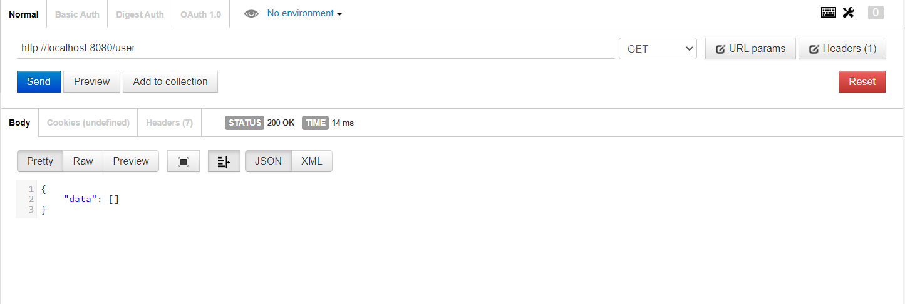
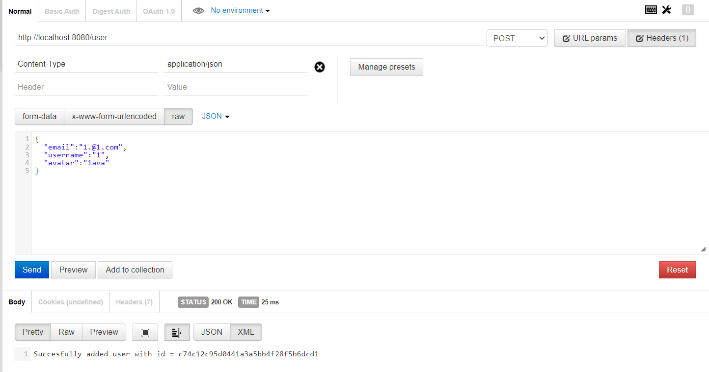
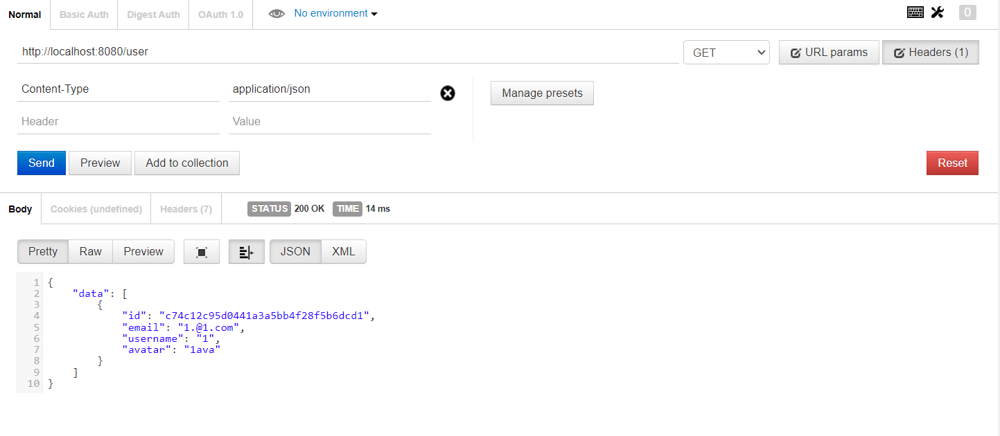
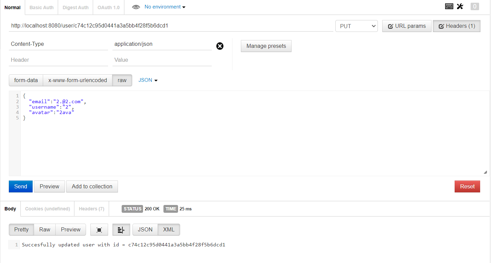
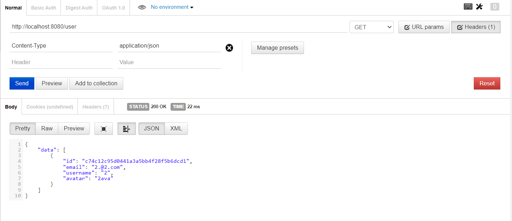
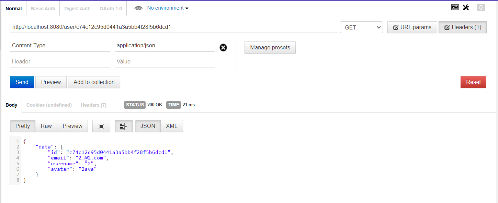
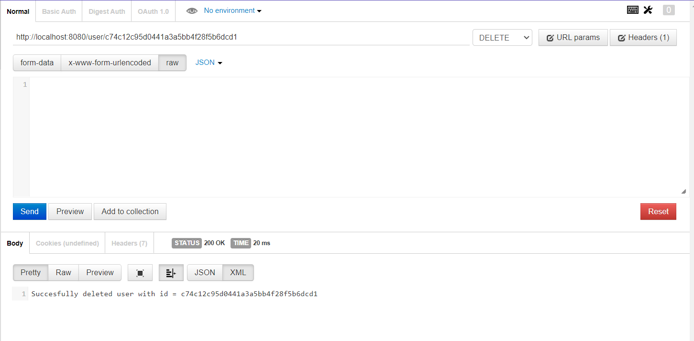
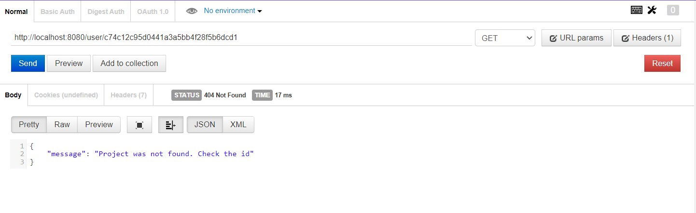
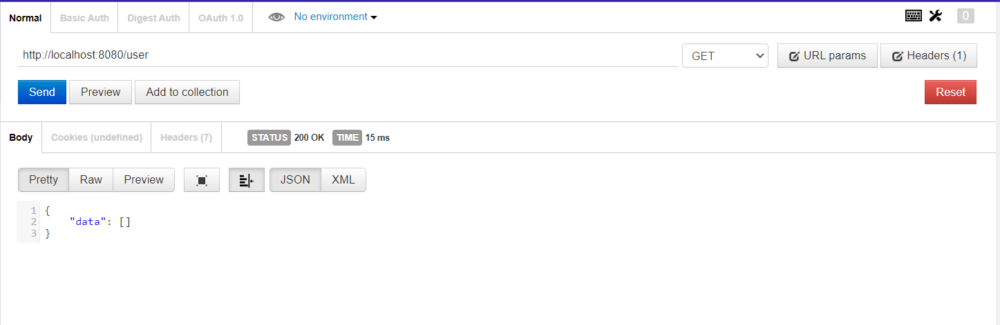

# Тестування працездатності системи

## Відображення всіх сутностей

## Додавання сутності (CREATE)

### Запит

### Результат

## Оновлення сутності по id (UPDATE)

### Запит

### Результат

## Зчитування сутності по id (READ)

### Результат

## Видалення сутності (DELETE)

### Запит

### Результат по id

### Результат

